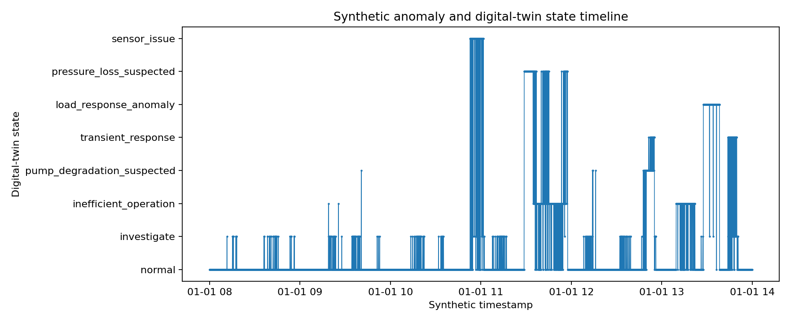
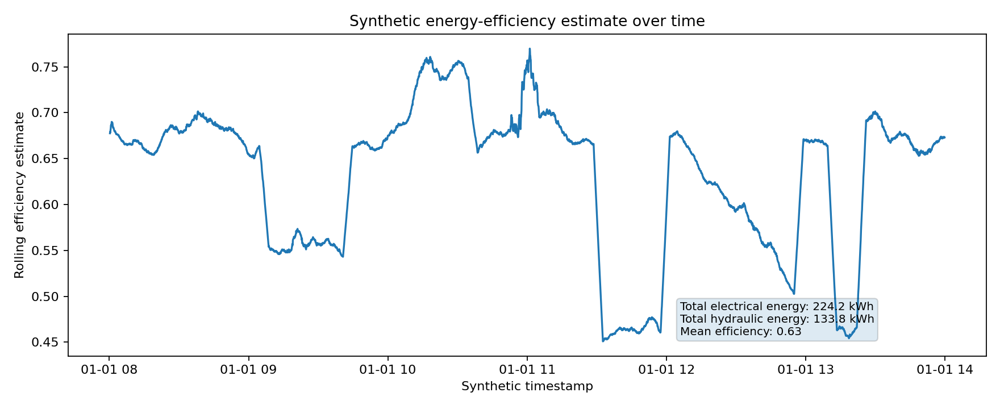
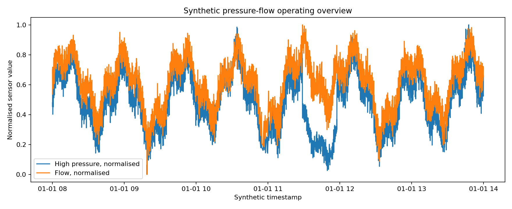

# Synthetic Hydraulic Digital Twin Demo
[](https://github.com/sergioald/synthetic-hydraulic-digital-twin-demo/actions/workflows/tests.yml)

A synthetic applied-AI research software demo for sensor-heavy hydraulic systems.

This repository demonstrates a reproducible Python workflow for generating synthetic hydraulic-system time series, validating sensor data, estimating energy use, detecting anomalies, classifying digital-twin operating states and producing engineering-style reports.

The project is designed as a public portfolio/research-software example. It is inspired by general experience with structural testing, monitoring systems and digital-twin workflows, but it does **not** reproduce any real facility, dataset, control system or proprietary architecture.

## Why this project exists

Many industrial and research systems generate large volumes of sensor data but cannot share the real data, controls or infrastructure publicly. This project shows how to communicate applied-AI capability safely using fully synthetic data and a transparent, testable software structure.

The intended audience includes research software teams, applied-AI groups, industrial digital-twin teams and organisations working on sensor monitoring, energy efficiency, anomaly detection or decision support.

## Workflow

```text
synthetic data generation
→ data validation
→ feature engineering
→ hydraulic/electrical energy estimation
→ anomaly detection
→ digital-twin state classification
→ recommendation/report generation
```

## Current status

The current version provides a minimal working synthetic digital-twin pipeline plus technical documentation and example visual outputs:

- synthetic hydraulic sensor-data generation
- sensor-data validation
- time-series feature engineering
- hydraulic and electrical energy estimation
- rule-based and Isolation Forest anomaly detection
- digital-twin state classification
- recommendation and markdown report generation
- CLI, quickstart example and tests
- model-validation, synthetic-data and anomaly-detection documentation
- portfolio summary and example figures

The implementation is intentionally simple and explainable. It is designed to show software structure, reproducibility and safe publication boundaries rather than to model a real hydraulic facility.

## Confidentiality boundary

This repository does not contain:

- real FastBlade data
- real University of Edinburgh code
- partner or industrial data
- proprietary control logic
- real facility diagrams
- real hydraulic parameters
- real sensor exports
- confidential reports or database schemas

All datasets, parameters and operating behaviours in this repository are generated synthetically.

See [`docs/confidentiality_statement.md`](docs/confidentiality_statement.md) and [`docs/system_abstraction.md`](docs/system_abstraction.md) for the publication boundary.

## Installation

Create and activate a virtual environment:

```bash
python -m venv .venv
source .venv/bin/activate
```

On Windows PowerShell:

```powershell
python -m venv .venv
.venv\Scripts\Activate.ps1
```

Install the project:

```bash
python -m pip install --upgrade pip
python -m pip install -e ".[dev]"
```

Install the pre-commit hooks:

```bash
pre-commit install
```

## Quickstart

Run the example script:

```bash
python examples/quickstart.py
```

Or use the command-line interface:

```bash
hydraulic-twin run \
  --config configs/default.yaml \
  --output reports/example_report.md \
  --data-output data/synthetic_run.csv
```

The CLI produces a synthetic dataset and a markdown report. The generated CSV is ignored by Git because it is a reproducible output.

Regenerate the example portfolio figures:

```bash
python examples/create_example_figures.py
```

## Example outputs

The repository includes static example figures generated from the synthetic pipeline. They are intended to make the project understandable without running the code first.

### Synthetic anomaly and digital-twin state timeline



### Synthetic energy-efficiency summary



### Synthetic pressure-flow overview



See [`docs/portfolio_summary.md`](docs/portfolio_summary.md) for a short reviewer-focused explanation of the project outputs and portfolio value.

## Development

Run repository checks:

```bash
pre-commit run --all-files
```

Run tests:

```bash
pytest
```

Run tests with coverage:

```bash
pytest --cov=hydraulic_twin --cov-report=term-missing
```

## Repository structure

```text
synthetic-hydraulic-digital-twin-demo/
  README.md
  pyproject.toml
  LICENSE
  CITATION.cff
  CHANGELOG.md
  .gitignore
  .pre-commit-config.yaml
  configs/
    default.yaml
  docs/
    anomaly_detection_method.md
    confidentiality_statement.md
    development.md
    model_validation.md
    portfolio_summary.md
    synthetic_data_design.md
    system_abstraction.md
    roadmap.md
  src/
    hydraulic_twin/
      __init__.py
      anomaly_detection.py
      cli.py
      data_generation.py
      energy_model.py
      features.py
      reporting.py
      twin_state.py
      validation.py
  tests/
    test_anomaly_detection.py
    test_data_generation.py
    test_energy_model.py
    test_twin_state.py
    test_validation.py
  examples/
    create_example_figures.py
    quickstart.py
  reports/
    example_report.md
    figures/
      anomaly_timeline.png
      energy_efficiency_summary.png
      pressure_flow_overview.png
  .github/
    workflows/
      tests.yml
```

## Synthetic measured variables

The synthetic dataset includes variables such as:

| Variable | Description |
|---|---|
| `timestamp` | Simulated measurement time |
| `reservoir_level_pct` | Synthetic reservoir level |
| `low_pressure_bar` | Synthetic low-pressure line pressure |
| `flow_lpm` | Synthetic hydraulic flow rate |
| `high_pressure_bar` | Synthetic high-pressure output |
| `return_pressure_bar` | Synthetic return-side pressure |
| `motor_power_kw` | Synthetic electrical power drawn |
| `motor_speed_rpm` | Synthetic motor speed |
| `motor_temperature_c` | Synthetic motor temperature |
| `accumulator_pressure_bar` | Synthetic pressure-storage measurement |
| `command_signal_pct` | Synthetic control demand signal |
| `load_demand_kn` | Synthetic structural load demand |
| `actuator_displacement_mm` | Synthetic actuator displacement |
| `vibration_proxy` | Synthetic vibration/audio-like proxy |
| `event_label` | Synthetic injected operating condition |

Derived variables include hydraulic power, cumulative energy, efficiency estimates, rolling features, anomaly flags and digital-twin state labels.

## License

MIT License.
