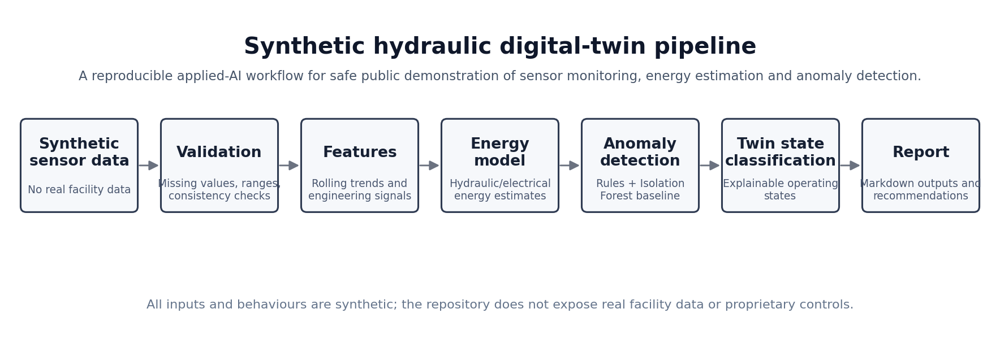
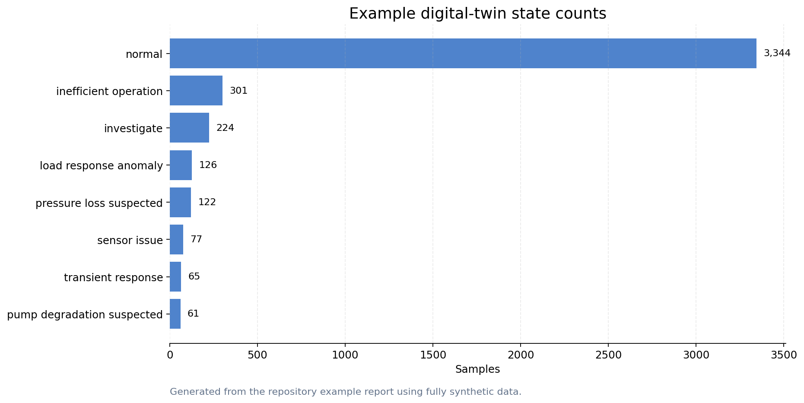
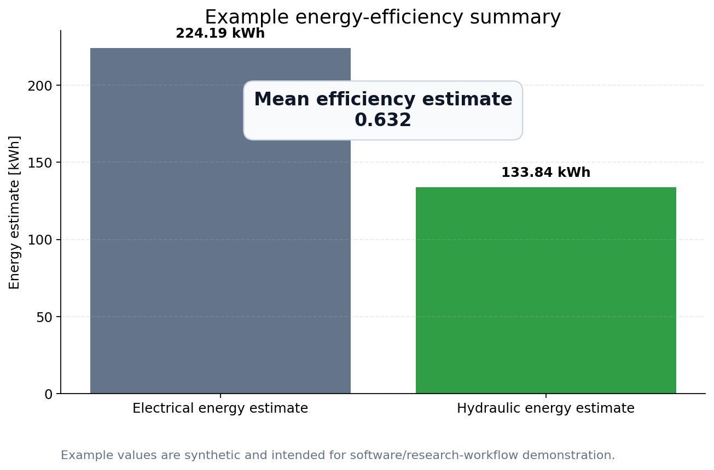
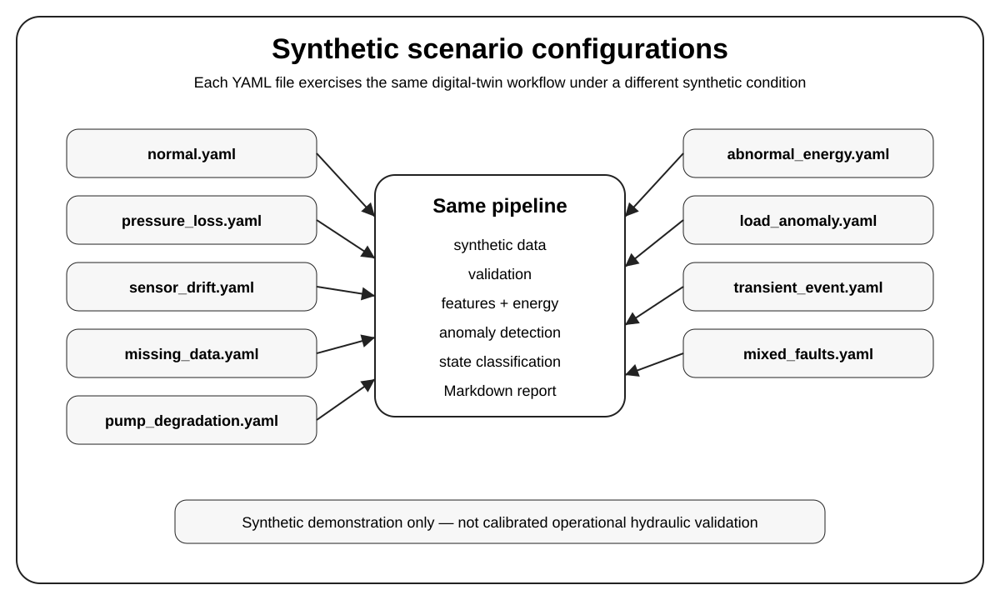

# Synthetic Hydraulic Digital Twin Demo

[](https://github.com/sergioald/synthetic-hydraulic-digital-twin-demo/actions/workflows/tests.yml)
[](pyproject.toml)
[](LICENSE)
[](https://urban-drainage-sensor-data-toolkit.streamlit.app/)

A **synthetic applied-AI / research-software demo** for sensor-heavy hydraulic systems.

This repository shows how a digital-twin-style workflow can generate synthetic time-series data, validate sensor signals, estimate energy use, detect anomalies, classify operating states, and produce engineering-style reports — without exposing real facility data or proprietary control logic.

<p align="center">
  
</p>

<p align="center">
  <em>A safe, reproducible public workflow for demonstrating applied AI on hydraulic sensor data.</em>
</p>

---

## Why this project exists

Real industrial and research facilities often produce valuable sensor data, but the raw data, controls, infrastructure details, and operating conditions cannot always be shared publicly.

This project demonstrates the same kind of applied-AI workflow using **fully synthetic data**. It is designed for portfolio review, research-software demonstration, teaching, and method discussion.

The project is intentionally explainable rather than physically exhaustive. It focuses on:

- clean software structure;
- reproducible examples;
- safe publication boundaries;
- sensor-data validation;
- energy and efficiency summaries;
- anomaly detection and state classification;
- scenario-based synthetic demonstrations;
- report generation for engineering review.

For a more detailed reviewer-facing explanation, see [`docs/portfolio_summary.md`](docs/portfolio_summary.md).

For reviewers, start with [`docs/case_study.md`](docs/case_study.md),
[`docs/reviewer_guide.md`](docs/reviewer_guide.md),
[`docs/validation_notes.md`](docs/validation_notes.md), and
[`docs/confidentiality_boundaries.md`](docs/confidentiality_boundaries.md). These explain the project as a confidentiality-safe applied-AI case study and clarify what should, and should not, be inferred from the synthetic workflow.

---

## What this repository demonstrates

| Area | What is included |
|---|---|
| Synthetic data | Hydraulic-style time-series variables generated without real facility data |
| Scenario configs | Reproducible YAML configurations for normal and fault-like synthetic scenarios |
| Validation | Range, missing-value, schema, timestamp, and reproducibility checks for sensor data |
| Feature engineering | Rolling statistics and derived engineering signals |
| Energy modelling | Electrical and hydraulic energy estimates plus efficiency summaries |
| Anomaly detection | Rule-based checks and an Isolation Forest baseline |
| Digital-twin states | Explainable state labels for review and reporting |
| Reporting | Markdown and optional HTML report generation with recommendations and summary metrics |
| Research software | CLI, config files, tests, docs, citation metadata, and reproducible examples |
| Publication boundary | Explicit validation notes and confidentiality boundaries for public release |

---

## Software implementation

The repository is implemented as a small, testable Python package rather than a notebook-only demonstration.

The main implementation choices are:

- `src/hydraulic_twin/` contains the importable workflow modules;
- `configs/default.yaml` and `configs/scenarios/*.yaml` make the synthetic assumptions visible;
- the `hydraulic-twin` CLI runs the full pipeline from a configuration file;
- `examples/` contains reproducible scripts for quick starts, figures, and scenarios;
- `tests/` checks data generation, validation, features, energy estimates, anomaly detection, reports, CLI execution, and scenario configurations;
- generated CSV, scenario reports, and optional HTML reports are treated as reproducible outputs rather than source data.

The workflow is intentionally simple and transparent. It is designed to demonstrate research-software structure, validation boundaries, and explainable engineering-AI outputs rather than to maximise modelling complexity.

---

## Example outputs

The figures below are generated from the repository's synthetic example run. They are included so the project can be understood before running the code.

### Digital-twin state counts

<p align="center">
  
</p>

<p align="center">
  <em>Example operating-state counts generated from synthetic data.</em>
</p>

### Energy-efficiency summary

<p align="center">
  
</p>

<p align="center">
  <em>Example electrical/hydraulic energy estimates and mean efficiency from the synthetic report.</em>
</p>

### Scenario overview

<p align="center">
  
</p>

<p align="center">
  <em>Scenario-specific YAML files exercise the same pipeline under different synthetic operating conditions.</em>
</p>

---

## Quick start

### 1. Create an environment

```bash
python -m venv .venv
source .venv/bin/activate
python -m pip install --upgrade pip
python -m pip install -e ".[dev]"
```

On Windows PowerShell:

```powershell
python -m venv .venv
.\.venv\Scripts\Activate.ps1
python -m pip install --upgrade pip
python -m pip install -e ".[dev]"
```

### 2. Run the example workflow

```bash
python examples/quickstart.py
```

Or run the CLI directly:

```bash
hydraulic-twin run \
  --config configs/default.yaml \
  --output reports/example_report.md \
  --data-output data/synthetic_run.csv
```

On Windows PowerShell:

```powershell
hydraulic-twin run `
  --config configs/default.yaml `
  --output reports/example_report.md `
  --data-output data/synthetic_run.csv
```

To also generate a local HTML report:

```bash
hydraulic-twin run \
  --config configs/default.yaml \
  --output reports/example_report.md \
  --html-output reports/example_report.html \
  --data-output data/synthetic_run.csv
```

On Windows PowerShell:

```powershell
hydraulic-twin run `
  --config configs/default.yaml `
  --output reports/example_report.md `
  --html-output reports/example_report.html `
  --data-output data/synthetic_run.csv
```

Generated CSV and HTML outputs are ignored by Git because they are reproducible outputs.

### 3. Run one synthetic scenario

```bash
hydraulic-twin run \
  --config configs/scenarios/pressure_loss.yaml \
  --output reports/scenarios/pressure_loss_report.md \
  --data-output data/scenarios/pressure_loss_synthetic_run.csv
```

On Windows PowerShell:

```powershell
hydraulic-twin run `
  --config configs/scenarios/pressure_loss.yaml `
  --output reports/scenarios/pressure_loss_report.md `
  --data-output data/scenarios/pressure_loss_synthetic_run.csv
```

### 4. Run all synthetic scenarios

```bash
python examples/run_scenarios.py
```

This generates one Markdown report and one synthetic CSV output per scenario. The generated outputs are reproducible and are ignored by Git.

### 5. Regenerate example figures

```bash
python examples/create_example_figures.py
python examples/create_scenario_overview_figure.py
```

---

## Synthetic scenarios

The scenario files in `configs/scenarios/` make the workflow easier to review because they show how the same pipeline behaves under different illustrative conditions.

| Scenario | Configuration | Purpose |
|---|---|---|
| Normal baseline | `configs/scenarios/normal.yaml` | Synthetic run with no injected fault event beyond normal operation |
| Pressure loss | `configs/scenarios/pressure_loss.yaml` | Illustrative pressure-loss event |
| Sensor drift | `configs/scenarios/sensor_drift.yaml` | Illustrative pressure-sensor drift |
| Missing data | `configs/scenarios/missing_data.yaml` | Illustrative missing critical sensor values |
| Pump degradation | `configs/scenarios/pump_degradation.yaml` | Illustrative temperature, vibration, and efficiency degradation |
| Abnormal energy | `configs/scenarios/abnormal_energy.yaml` | Illustrative high energy-use period |
| Load anomaly | `configs/scenarios/load_anomaly.yaml` | Illustrative command/load mismatch |
| Transient event | `configs/scenarios/transient_event.yaml` | Illustrative short transient response |
| Mixed faults | `configs/scenarios/mixed_faults.yaml` | Combined synthetic scenario containing multiple illustrative events |

For details, see [`docs/scenario_configs.md`](docs/scenario_configs.md).

---

## Main outputs

| Output | Purpose |
|---|---|
| `data/synthetic_run.csv` | Generated synthetic sensor dataset |
| `reports/example_report.md` | Markdown engineering-style summary report |
| `reports/*.html` | Optional generated HTML reports for local review |
| `reports/figures/` | Example portfolio figures generated from synthetic data |
| `reports/scenarios/` | Generated scenario-specific Markdown reports |
| `data/scenarios/` | Generated scenario-specific synthetic CSV outputs |
| `docs/portfolio_summary.md` | Reviewer-facing explanation of the project value |
| `docs/validation_notes.md` | Practical validation notes and reviewer interpretation guide |
| `docs/confidentiality_boundaries.md` | Public/private boundary for data, reports, and implementation details |
| `docs/validation_scope.md` | Explanation of what the tests do and do not prove |
| `docs/model_card.md` | Model-card style statement of intended use and limitations |

Generated CSV, scenario-report, and HTML outputs are reproducible and are intentionally ignored by Git.

---

## Synthetic data boundary

This repository does **not** contain:

- real FastBlade data;
- real University of Edinburgh code;
- partner or industrial datasets;
- proprietary control logic;
- real facility diagrams;
- real hydraulic parameters;
- real sensor exports;
- confidential reports or database schemas.

All datasets, parameters, operating behaviours, labels, figures, and reports in this repository are synthetic.

See:

- [`docs/confidentiality_statement.md`](docs/confidentiality_statement.md)
- [`docs/confidentiality_boundaries.md`](docs/confidentiality_boundaries.md)
- [`docs/system_abstraction.md`](docs/system_abstraction.md)
- [`docs/synthetic_data_design.md`](docs/synthetic_data_design.md)
- [`docs/scenario_configs.md`](docs/scenario_configs.md)
- [`docs/validation_notes.md`](docs/validation_notes.md)
- [`docs/validation_scope.md`](docs/validation_scope.md)

---

## Method overview

The workflow is organised as a small but complete research-software pipeline:

```text
synthetic data generation
→ sensor validation
→ feature engineering
→ hydraulic/electrical energy estimation
→ anomaly detection
→ digital-twin state classification
→ markdown/html report generation
```

The anomaly-detection layer combines transparent rule-based checks with a simple Isolation Forest baseline. The digital-twin state classifier converts validation, anomaly, and energy-efficiency signals into interpretable state labels such as `normal`, `sensor_issue`, `pressure_loss_suspected`, and `inefficient_operation`.

---

## Testing and validation scope

The test suite includes:

- unit tests for data generation, validation, feature engineering, energy estimation, anomaly detection, reporting, and state classification;
- integration tests for the configured full pipeline;
- smoke tests for quick command-line execution;
- scenario-configuration tests.

The tests verify software behaviour and reproducibility of the synthetic workflow. They do **not** prove physical calibration, operational diagnostic reliability, safety-critical suitability, or validity against real facility data.

For details, see [`docs/validation_notes.md`](docs/validation_notes.md) and [`docs/validation_scope.md`](docs/validation_scope.md).

---

## Development

Run tests:

```bash
pytest
```

Run tests with coverage:

```bash
pytest --cov=hydraulic_twin --cov-report=term-missing
```

Run formatting/lint checks:

```bash
pre-commit run --all-files
```

Run scenario tests only:

```bash
pytest tests/test_scenario_configs.py
```

---

## Repository structure

```text
synthetic-hydraulic-digital-twin-demo/
  README.md
  pyproject.toml
  LICENSE
  CITATION.cff
  CHANGELOG.md
  configs/
    default.yaml
    scenarios/
      normal.yaml
      pressure_loss.yaml
      sensor_drift.yaml
      missing_data.yaml
      pump_degradation.yaml
      abnormal_energy.yaml
      load_anomaly.yaml
      transient_event.yaml
      mixed_faults.yaml
  docs/
    portfolio_summary.md
    anomaly_detection_method.md
    confidentiality_statement.md
    confidentiality_boundaries.md
    development.md
    html_reports.md
    model_card.md
    model_validation.md
    scenario_configs.md
    synthetic_data_design.md
    system_abstraction.md
    validation_notes.md
    validation_scope.md
    roadmap.md
    assets/
      readme_workflow.png
      readme_state_counts.png
      readme_energy_summary.png
      readme_scenario_overview.svg
  examples/
    quickstart.py
    create_example_figures.py
    create_scenario_overview_figure.py
    run_scenarios.py
  reports/
    example_report.md
    figures/
  src/hydraulic_twin/
    anomaly_detection.py
    cli.py
    data_generation.py
    energy_model.py
    features.py
    reporting.py
    twin_state.py
    validation.py
  tests/
```

---

## Documentation

Useful supporting documents:

- [`docs/portfolio_summary.md`](docs/portfolio_summary.md) — reviewer-facing project explanation
- [`docs/case_study.md`](docs/case_study.md) — reviewer-facing applied-AI case study
- [`docs/reviewer_guide.md`](docs/reviewer_guide.md) — quick guide for technical reviewers
- [`docs/model_card.md`](docs/model_card.md) — intended use, limitations, data boundary, and validation status
- [`docs/validation_notes.md`](docs/validation_notes.md) — practical validation notes and reviewer interpretation
- [`docs/validation_scope.md`](docs/validation_scope.md) — what the tests do and do not prove
- [`docs/confidentiality_boundaries.md`](docs/confidentiality_boundaries.md) — public/private boundary for data, reports, and implementation details
- [`docs/confidentiality_statement.md`](docs/confidentiality_statement.md) — publication boundary
- [`docs/synthetic_data_design.md`](docs/synthetic_data_design.md) — synthetic data design notes
- [`docs/scenario_configs.md`](docs/scenario_configs.md) — scenario-configuration guide
- [`docs/html_reports.md`](docs/html_reports.md) — how to generate and interpret HTML reports
- [`docs/anomaly_detection_method.md`](docs/anomaly_detection_method.md) — anomaly-detection approach
- [`docs/model_validation.md`](docs/model_validation.md) — validation and limitation notes
- [`docs/roadmap.md`](docs/roadmap.md) — suggested future improvements

---

## Citation

If you use this repository as an example or teaching resource, please cite it using the metadata in [`CITATION.cff`](CITATION.cff).

---

## License

This project is released under the MIT License. See [`LICENSE`](LICENSE).
